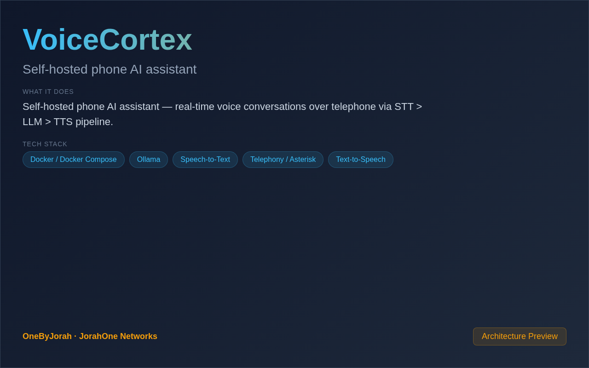

<div align="center">


# VoiceCortex

Self-hosted phone AI assistant


</div>

---

<p align="center">
  
</p>

<br>

---

## Features

- **Phone Integration** —接听电话并进行语音对话.
- **STT Pipeline** — Speech-to-text with faster-whisper.
- **LLM Processing** — AI-powered conversation with local/cloud LLMs.
- **TTS Output** — Natural speech synthesis with Piper.
- **Real-Time** — Low-latency WebSocket streaming.
- **Call Logging** — Record and transcribe all calls.
- **Multi-Provider** — Twilio, Asterisk, and SIP support.
- **Docker Ready** — Easy deployment with Docker.

## Quick Start

```bash
git clone https://github.com/OneByJorah/VoiceCortex.git
cd VoiceCortex

cp .env.example .env
docker compose up -d
```

### Local Development

```bash
pip install -r requirements.txt
python3 voicecortex.py
```

## Configuration

| Variable | Default | Description |
|----------|---------|-------------|
| `STT_PROVIDER` | `faster-whisper` | Speech-to-text provider |
| `STT_MODEL` | `base` | STT model size |
| `LLM_PROVIDER` | `ollama` | LLM provider |
| `LLM_MODEL` | `llama2` | LLM model name |
| `TTS_PROVIDER` | `piper` | Text-to-speech provider |
| `TTS_VOICE` | `en_US-lessac` | TTS voice |
| `TWILIO_SID` | — | Twilio account SID |
| `TWILIO_TOKEN` | — | Twilio auth token |
| `PORT` | `8080` | API port |

## Architecture

```
Phone Call ──▶ VoiceCortex ──▶ STT ──▶ LLM ──▶ TTS ──▶ Phone Response
                    │
                    ├──▶ faster-whisper
                    ├──▶ Ollama/OpenAI
                    ├──▶ Piper
                    └──▶ Call Logger
```

## Project Structure

```
VoiceCortex/
├── voicecortex.py          # Main entry point
├── pipeline/
│   ├── __init__.py
│   ├── stt.py              # Speech-to-text
│   ├── llm.py              # Language model
│   ├── tts.py              # Text-to-speech
│   └── phone.py            # Phone integration
├── providers/
│   ├── twilio.py           # Twilio integration
│   ├── asterisk.py         # Asterisk integration
│   └── sip.py              # SIP protocol
├── docker-compose.yml      # Docker deployment
├── requirements.txt        # Python dependencies
└── README.md
```

## Contributing

Contributions are welcome. Please see [CONTRIBUTING.md](CONTRIBUTING.md) for guidelines and [CODE_OF_CONDUCT.md](CODE_OF_CONDUCT.md) for community standards.

## Security

For security concerns, see [SECURITY.md](SECURITY.md). Please report vulnerabilities to **info@jorahone.com** — do not use public issues.

## License

MIT © Jhonattan L. Jimenez

---

## 🤝 Contributing

See [CONTRIBUTING.md](CONTRIBUTING.md). All contributions follow the [Code of Conduct](CODE_OF_CONDUCT.md).

## 🔒 Security

Found a vulnerability? Please follow our [Security Policy](SECURITY.md) and report privately to `security@jorahone.com`.

## 📄 License

[MIT License](LICENSE) © Jhonattan L. Jimenez (OneByJorah)

---

<p align="center">Built with 🌴 by <a href="https://github.com/OneByJorah">OneByJorah</a> · <a href="https://jorahone.com">jorahone.com</a></p>
